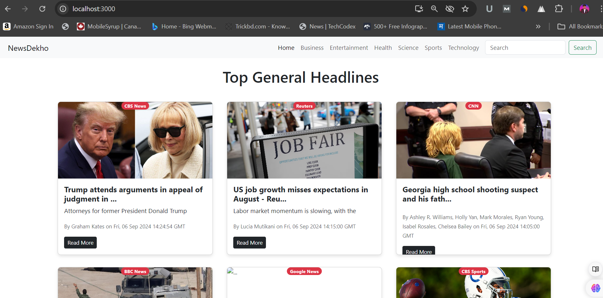

# Getting Started with Create React App
# Note: GitHub Pages may not support client-side routing properly with React Router, which can lead to 404 errors on non-root routes. For a fully functional experience, please clone the repository and run it locally using npm start.


Here’s a README file for your project:

---

# NewsDekho - React News Application

## Description
NewsDekho is a dynamic news application built using React and powered by the News API. The application allows users to browse news articles by categories such as Business, Entertainment, Health, Science, Sports, and Technology. Additionally, users can perform a search to fetch specific news articles. The app implements features like pagination and loading spinners to enhance the user experience.

## Features
- **Category-based News:** Users can browse top news headlines based on predefined categories.
- **Search Functionality:** Users can search for news articles by keywords.
- **Pagination:** Articles are paginated to improve loading performance. Users can navigate between pages using "Previous" and "Next" buttons.
- **Loading Indicator:** Displays a loading spinner while fetching data from the API.
- **Error Handling:** Displays appropriate error messages in case of API failure or no search results.
- **Responsive Design:** The app layout is responsive and works seamlessly across devices.

## Technology Stack
- **React**: A JavaScript library for building user interfaces.
- **React Router**: Used for navigating between different pages (categories).
- **News API**: Used to fetch the latest news articles.
- **Bootstrap**: Used for responsive styling and layout.

## Installation

### Prerequisites
- **Node.js** and **npm** installed on your local machine.

### Steps to Install
1. Clone this repository:
   ```
   git clone https://github.com/your-username/newsdekho.git
   ```
2. Navigate to the project directory:
   ```
   cd newsdekho
   ```
3. Install dependencies:
   ```
   npm install
   ```

4. Get an API key from [NewsAPI](https://newsapi.org) by creating an account.

5. Create a `.env` file in the root directory and add your API key:
   ```
   REACT_APP_NEWS_API_KEY=your-api-key
   ```

6. Start the development server:
   ```
   npm start
   ```

## Usage
- On the homepage, you can browse top headlines.
- Use the navigation menu to switch between different news categories.
- Use the search bar to search for news articles by keywords.
- Pagination controls will appear if there are multiple pages of results.

## Components
- **Navbar**: Contains the navigation links for categories and a search bar.
- **News**: Fetches and displays news articles, handles pagination and search queries.
- **NewsItem**: Displays individual news articles, including title, description, image, and a link to the full article.
- **Spinner**: Shows a loading spinner while the news data is being fetched.

## API
The app uses the [NewsAPI](https://newsapi.org) to fetch news data. You must have an API key to access the API.

## Props
- `country`: Sets the country for top headlines (default: "in" for India).
- `category`: Determines the category of news (e.g., business, technology, etc.).
- `pageSize`: Number of articles displayed per page (default: 12).
- `searchQuery`: Query parameter for searching news articles.


---

This README should give a clear overview of the project, installation instructions, and key features. Let me know if you'd like any adjustments!